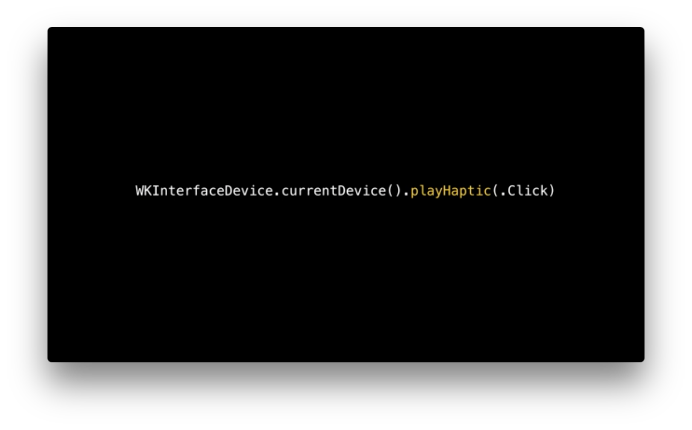
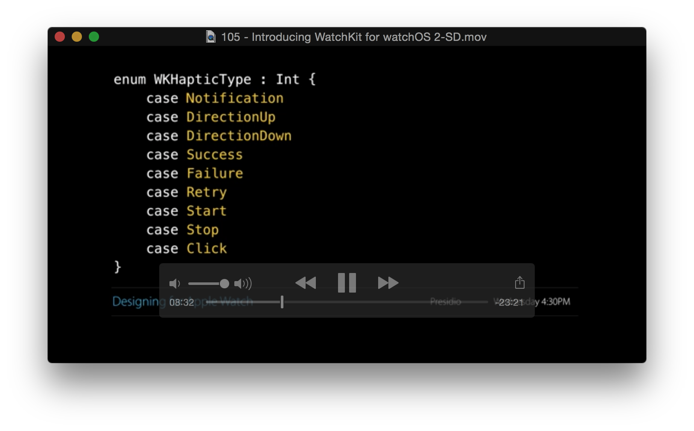
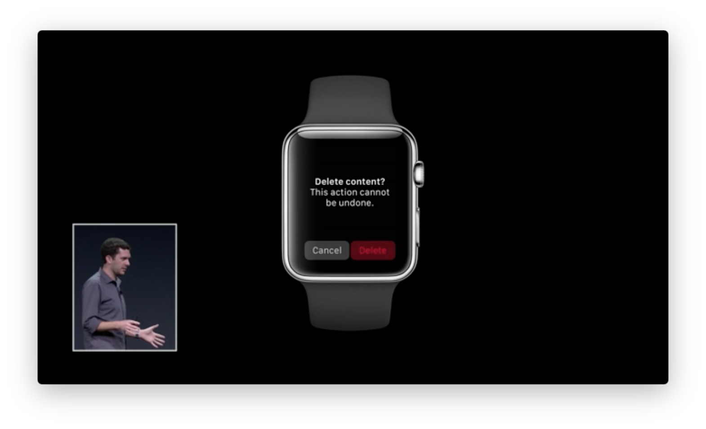
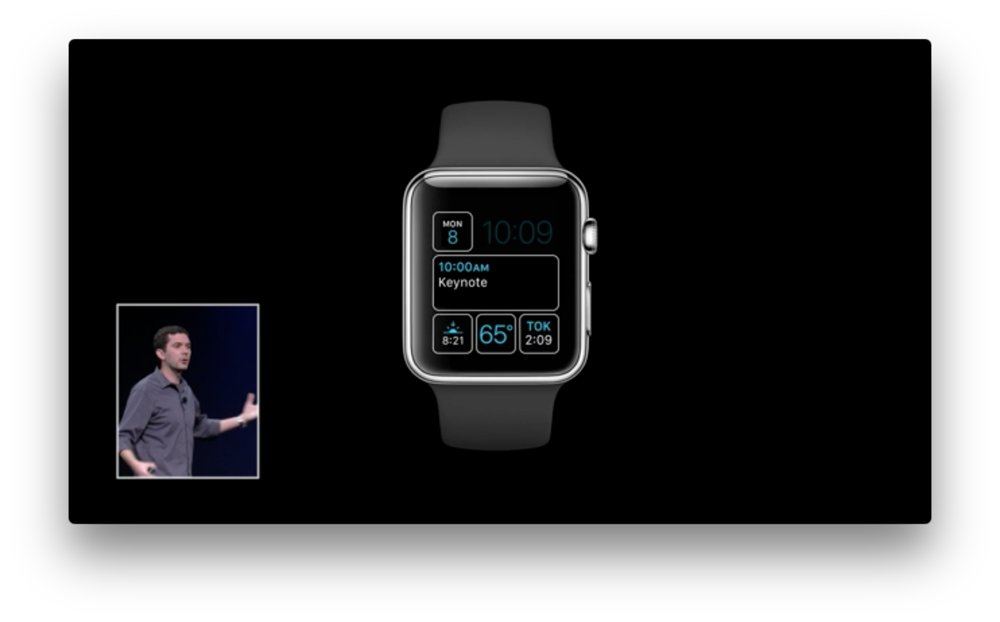
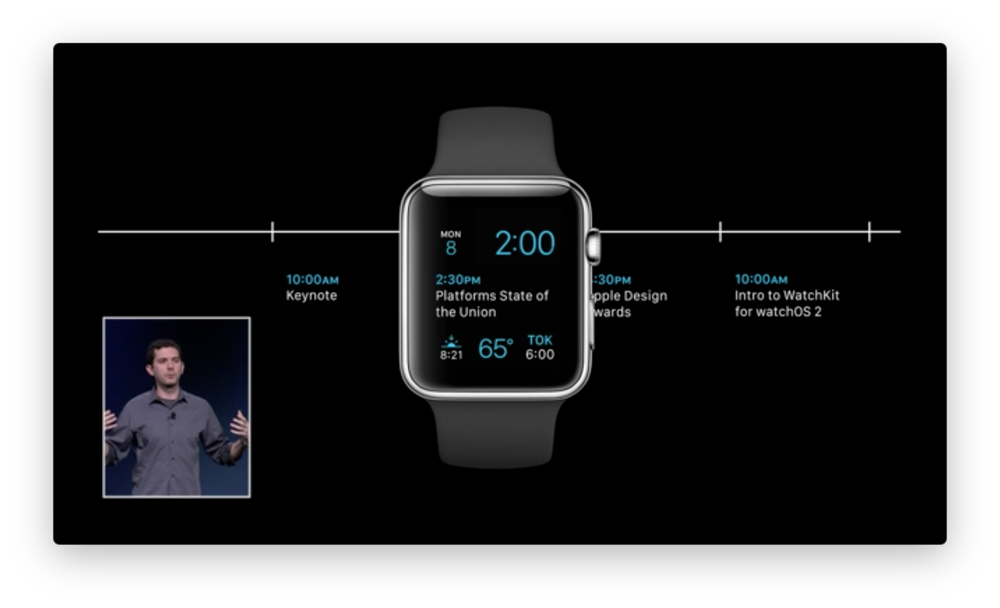
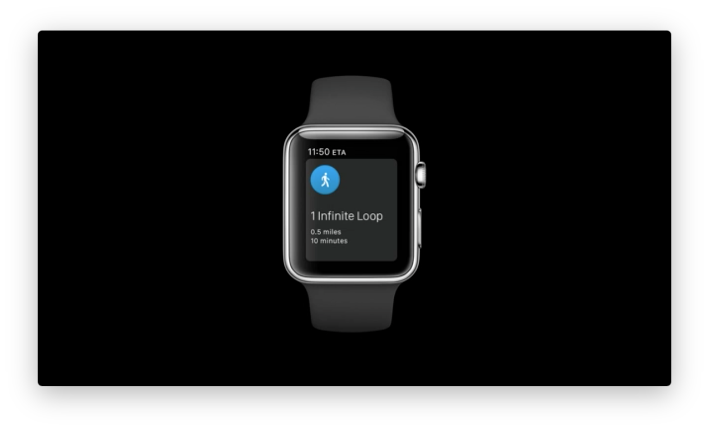

# 105: Introducing WatchKit for WatchOS 2

**Link:** [https://developer.apple.com/videos/wwdc/2015/?id=105](https://developer.apple.com/videos/wwdc/2015/?id=105)

This is a short, introductory videos about all the new features introduced with Apple WatchOS 2. For each funcionality a specific video will be available.

Of course the big news is that the new Apple WatchOS 2 can run native application without the iPhone. 
The Apple watch can access directly to the nework, even if the iPhone is not present (wifi?)

### What's new?

#### Digital Crown
Is possible to interact with the digital crown showing three different layout:
* list (like the watch complication)
* stack style (a lisf of full screen images with a cool transition between each image)
* image sequnce (a list of images, like emoji selection on apple watch)
The digital crown can be used toghter with "Coordinate Images" to run an animation using the crown

#### Animation
All the properties of the UI elements can be setted at runtime.
An api for animating the view is available and is similar to the one available on UIKit

Is possible to interact with the Tapting Engine using diffent style of vibration

#### Micropone
Is possible to inteact with the microphone, the application receive the recorded file from the operating system.

#### Audio and Video
Is possible to play local or remote videos, and play audio file even on background.

#### Alert
Aler are available on WatchOS2

#### System URL
From the app is possible to open URL for sms and tel.

#### Passkit
Passkit is synched with the iPhone.

#### ClockKit
ClockKit is the new framework fro create the Apple Watch Complication.
If you don't know what Complication are, check the video "state of the union". Basically are widget for apple watch.

Data must be provided in form of a "timeline" in this way the OS can show the appropriate information at the right time.

#### Networking
The Apple Watch can have access to the network. If use NSURLSession everyting should work fine.

#### Watch connectivity

Watch Connectivity is a new framework for allow communication between Apple Watch an the iPhone.
Is possible to synch dictionaries of data (Application Context sync) or transfer file.

Is also possible to send an "interacting message" from the apple wath to the phone (not viceversa)

#### CoreMotion
Application can have access to the acelerometer information even when the app is closed.

#### CoreLocation
CoreLocation should provide new and simply api for access to the user location.
Permission are shared. Is not required anymore to accept the request on both the devices.

#### HealtKit
HealtKit is part of the WatchOs framwork and allow the app to access to the healt information even when the app is closed.

#### Security

Security framewok provides access to the keychain and the data can be accessed only when the user is wearing the watch.

#### MapKit
The map framwork is available

#### Contact framework
The contact framwork is available

#### Calendar framework
EventKit is available

---

More information on: [WatchOS2 transition guide](https://developer.apple.com/library/prerelease/watchos/documentation/General/Conceptual/AppleWatch2TransitionGuide/index.html)

