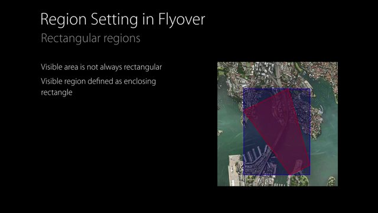

# 206: What's New in MapKit

**Link:** [https://developer.apple.com/videos/wwdc/2015/?id=206]()

## Improvments to existing Api
Since iOS9 is possible to customize the color of the default `MKPinAnnotationView` and is also possible to provide a custom `UIView` for the callout.

Along all the other information is possible to show / hide traffic, scale and compass.

Search results for `MapKit` and `CLGeocoder` can provide a time zone for the result.
This information is not available now on the official documentation, but you can see a new property `timeZone` for the `CLPlacemark` class on the api diff. [https://developer.apple.com/library/prerelease/ios/releasenotes/General/iOS90APIDiffs/frameworks/CoreLocation.html]()

## Transit
Is possible to get information about ETA using public transportation. To get these info use  `MKDirectionTransportType` and watch the demo.

## Flyover
Flyover was available since iOS6 on Map app, and now is available also for custom `MKMapView`, just specify the type of the map:

* `SatelliteFlyover`
* `HibridFlyover`

Because the Flyover images are mapped on real sphere and are "pinched", is hard to specify the region using a rectangle.
In that case `MKMapKit` can approximate a rectangle:

But the better option is to start using `MKMapCamera` class. We can create a nee camera specifying info like the camera center, the pinch, and the distance from the point and `MKMapKit` will take care of the magic. Some properties of the camera are animatable.
