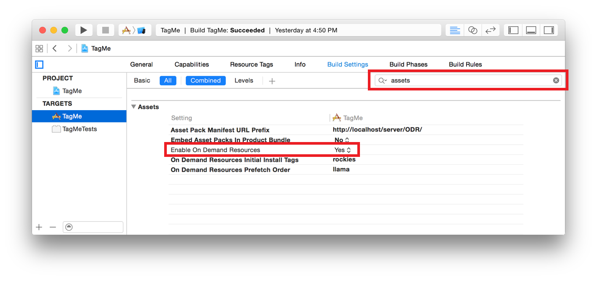

# 214: Introducing On Demand Resources

**Link:** [https://developer.apple.com/videos/wwdc/2015/?id=214]()

**Sample project:** [https://developer.apple.com/library/prerelease/ios/samplecode/DemoBots/Introduction/Intro.html]()

**User Guide:** [https://developer.apple.com/library/prerelease/ios/documentation/FileManagement/Conceptual/On_Demand_Resources_Guide/index.html#//apple_ref/doc/uid/TP40015083]()

> iOS 9 introduces On Demand Resources, enabling the efficient delivery of rich games and full featured applications using dynamically loaded content. Significantly reduce the time between purchasing and running an app from the App Store, while also decreasing the required storage space by downloading and retaining only content that is necessary. Dive into the latest enhancements in app packaging and learn the APIs to allow your app to acquire only its essential resources.

## Intro
An application contains the executable, some base resources and a list of optional resources, and not all the optional resources are needed at any time. On Demand Resource (odr) is an Apple service that allow the user to download these resources only when he needs.

## Advantages
ODR uses a custom caching algorithm, and he can delete the resources when are not needed anymore.

* Resources Hosted on App Store
* Some resources can be downlodaded during app install
* Some resources can be automated downloaded after the installation bug before first launch.
* Up to 20 GB of data stored for free on Apple servers
* Improve install experience (faster)
* Levels and resources can be better because there is no need to save space using poor image quality anymore.

## Demo
A 10 min demo start from min. 12 of the video and covers everything you need to know to start using ODR.

In order to start using ODR you should follow these steps

* add a tag for each resource or folder on xcode
* shared resources can have multiple tags.
* create an instance of the class `NSBundleResourceRequest` to start download assets with a tag.
* Use the completion block (is not executed on main thread) to inform the user in case of error
* If there are no errors, start using the resources with the same api as before, for example `imageNamed:`
* Use the new debug view to check if assets are downloaded correctly.
* Dismiss the `request` to inform the system that resources are not required anymore.
* Observe the `progress` of the request to show a progressbar to the user
* Specify the `downloadPriority` and the `preservationPriority` to tweak the cache system behaviour.

## Other Info ##

* Resources are provided to the device from xCode during the debug or using xcode server / testfligh during the QA.
* For enterprise application, resources can be hosted on a custom webserver protected with password. No additional information so far.
* For automatically fetch assets during the installation or immediately after, add the required tags to xcode settings.

